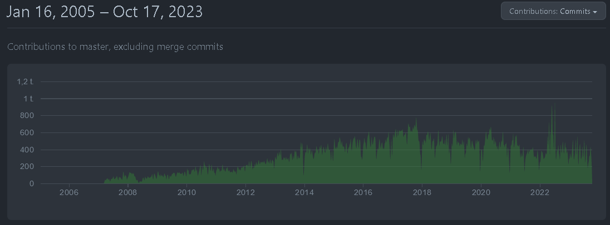

# Firefox

Firefox on Mozilla-säätiön kehittämä luotettavana ja ilmaisena tunnettu internetselain.
Sen yksi suurimmista vahvuuksista on avoimen lähdekoodin luonne, mikä mahdollistaa sitä käyttävän yhteisön osallistumisen sen kehittämiseen.
Firefox on saatavilla monille eri käyttöjärjestelmille, kuten Windows, macOS ja Linux, mikä tekee siitä monipuolisen vaihtoehdon käyttäjille.

---
## Toimintaperiaatteet ja käyttö

#### Miten firefox toimii?
Kuten muillakin verkkoselaimilla, Firefoxin keskeisin toiminnallisuus on
tarjota graafinen käyttöliittymä internetin selaamiseen ja navigointiin. Selailun tehostamiseen Firefox
tarjoaa esimerkiksi välilehtiä, kirjanmerkkejä ja lisäosia.

Kun käyttäjä syöttää verkkosivun osoitteen tai painaa hakusivun linkkejä, Firefox lähettää HTTP-pyynnön
sitä vastaavalle verkkosivun palvelimelle. Seuraavaksi Firefox voi alkaa renderöimään palvelimelta
mahdollisesti vastaanotettua HTML-koodia ja muita sivun resursseja (Kuvat, Tyylitiedostot ja JavaScript-tiedostot).

Kuvateksti: Firefoxin web-kehittäjän työkalut paneeli.

#### Missä Firefoxia käytetään?
**Yksityiskäyttö:** Yksityiset ihmiset voivat käyttävät Firefoxia päivittäiseen verkkoselaamiseen
  henkilökohtaisilla tietokoneillaan.

* **Yritykset ja organisaatiot:** Monet yritykset ja organisaatiot käyttävät Firefoxia työntekijöidensä
  selainvalintana sen tarjoaman turvallisuuden vuoksi.

* **Ohjelmistokehitys ja testaus:** Web-kehittäjät ja testaajat saattavat käyttää Firefoxin Developer-versiota ja sen työkaluja sivustojen ja sovellusten kehitystyössä/testaamisessa

* **Yksityisyyttä tarvitsevat:** Firefoxin painopiste yksityisyyden suojaamisessa tekee siitä suositun valinnan niille,
  jotka haluavat vähentää seurantaa, mainosten kohdistamista tai muuten vain pienentää omaa näkyvyyttä verkossa.

* **Linux-käyttäjät:** Firefox on usein oletuksena mukana monissa Linux-jakeluissa. Firefox on muutenkin suosittu selain avoimen lähdekoodin yhteisössä.

---
## Lisenssi
### [MPL](https://www.mozilla.org/en-US/MPL/)
Firefoxin lisenssi on Mozilla Public License (MPL) -lisenssi.
Se on avoimen lähdekoodin lisenssi ja se mahdollistaa ohjelmiston vapaan käytön, muokkaamisen ja jakamisen tietyin ehdoin.

### Sallittua:

1. **Voit käyttää Firefoxia kaupallisesti ja henkilökohtaisesti ilman lisenssimaksuja.**

2. **Voit muokata Firefoxin lähdekoodia ja luoda omia versioita.**

3. **Voit jakaa Firefoxin tai muokatun version edelleen avoimen lähdekoodin periaatteiden mukaisesti.**

### Rajoitukset:

1. **Jos muokkaat Firefoxin lähdekoodia ja luot oman version, sinun on jaettava muokkaamasi lähdekoodi MPL:n ehtojen mukaisesti.**

2. **Jos jaat Firefoxin tai sen muokatun version, et voi lisensoida sitä MPL:n ehtojen vastaisesti.**

3. **Mozilla ei tarjoa takuuta tai vastuuta Firefoxin käytöstä, ja lisenssi toimitetaan "sellaisenaan" ilman takuita.**

Yleisluontoisiin kysymyksiin Mozilla vastaa heidän omassa [FAQ:ssaan](https://www.mozilla.org/en-US/MPL/2.0/FAQ/)

---
## Projektin Historia ja Aktiivisuus:

#### Projektin historia:
Firefoxin kehitys alkoi vuonna 2002 nimellä "Phoenix" kun kehittäjät Dave Hyatt ja Blake Ross alkoivat karsimaan
heidän mielestään turhia ominaisuuksia toisesta aikaisesta internet-selaimesta nimeltä Mozilla Suite.
Projekti ei kuitenkaan ollut aina avoin, vaan sen lähdekoodi julkaistiin myöhemmin vuonna 2003 vastauksena
Mozillan saamaan kritiikkiin. Tämän julkaistun version nimi on myös nykyisin tuttu Mozilla Firefox.
Tästä lähtien Firefox on pysynyt avoimen lähdekoodin projektina ja on noussut yhdeksi isoimmaksi vaihtoehdoksi
muiden ei avointen internet-selainten rinnalle. (Chrome, Microsoft Edge, Opera)

#### Merkittäviä muutoksia Firefoxissa:

* Välilehdet
* Laajennus ja Plugin Ekosysteemi
* Gecko-renderöintimoottori
* Yksityis-ikkunat
* Quantum-moottori

#### Aktiivisuus:

Kuvateksti: Committien määrän historia

#### Kuka tai ketkä ylläpitävät projektia?

Firefoxin julkisivua ylläpitää Mozilla Corporation joka on voittoa tavoittelematon organisaatio mikä
keskittyy avoimen lähdekoodin ohjelmistojen kehittämiseen ja Internetin avoimuuden puolustamiseen. Mozilla on
myös isossa osassa Firefoxin kehitystä. Mozillan oman kehittäjätiimin lisäksi Mozillaa päivittää ja ylläpitää
tuhannet yhteisön jäsenet ympäri maailmaa.

### [Firefoxin Git mirror](https://github.com/mozilla/gecko-dev)

### Osallistuminen Projektiin

- **Contribution Model:** \[Miten projektiin voi osallistua? Onko olemassa tiettyjä rooleja tai vastuita?\]
- **Osallistumisen Menettelytavat:** \[Kuinka voit osallistua projektiin?\]
___
### Tekninen Toteutus
**Kielet:**
- Eniten käytetyt kielet ovat:  C++, JavaScript, HTML, C, Rust, Python, XML, Assembly
	- Vähän yli puolet koodista on C++ ja Javascriptiä

- Syyskuussa 2023 Firefoxin lähdekoodiin lisättiin yli 720,000 riviä Rust koodia. Tämä on suurin määrä koodia, mitä projektiin on lisätty yksittäisen kuukauden aikana koko sen historiassa.[^languages]

	
**Protokollat:**
 Selaimena Firefox käyttää useita erilaisia protokollia, joista muutamia tärkeimpiä tai mielenkiintoisimpia ovat:
- **HTTP/HTTPS** selaimen ja verkkosivujen väliseen kommunikointiin.[^http] [^https]
- **WebRTC protokollat**, kuten *ICE*, *STUN*, ja *TURN* mahdollistavat esimerkiksi video- ja äänipuhelut, sekä tiedostojen jakamisen suoraan selaimessa.[^webrtc]
- Googlen **safebrowsing** protokolla, joka varoittaa vaarallisista tai harhaanjohtavista verkkosivuista, sekä tiedostoista jotka sisältävät viiruksia.[^safebrowsing]

**Välineet:**
 - **Mercurial**. Lähdekoodin ja versionhallinta
 - **MDN Web Docs**. Dokumentaatiota web teknologioista ja Firefoxista.
 - **Developer tools**. Erilaisia selaimeen sisäänrakennettuja työkaluja, joilla on mahdollista analysoida, testata, ja debugata selaimen tai verkkosivujen eri ominaisuuksia.
___
### Projekti Käyntiin
**Windows:**  Mozillan omilta [sivuilta](https://www.mozilla.org/en-US/firefox/all/) saa helppokäyttöisen installerin, jolla selaimen asentaminen tapahtuu.

**Linux:**  Jakelusta riippuen Firefoxin asentaminen voi tapahtua usealla eri tavalla. Useimpien jakeluiden paketinhallintajärjestelmistä löytyy jonkilainen Firefox paketti. Jos Firefox ei kuitenkaan ole valitun jakelun omassa paketinhallintajärjestelmässä, voi sen asentaa esimerkiksi flatpack tai snap paketinhallintajärjestelmillä. Asennus tapahtuu seuraavasti esimerkiksi:
- Debian: `sudo apt install firefox-esr`
- Fedora: `sudo dnf install firefox`
- Snap: `sudo snap install firefox`
- Flatpak: `flatpak install flathub org.mozilla.firefox`

**Mac:** Kuten Windowsilla, oikean version Firefoxin asennustyökalusta saa samalta [sivulta](https://www.mozilla.org/en-US/firefox/all/), joka automaattisesti tunnistaa, että käytät Mac laitetta ja tarjoaa sinulle sopivan paketin.

#### Kääntäminen lähdekoodista:
Mozilla tarjoaa ohjeet Firefoxin kääntämiseen lähdekoodista [Windowsilla](https://firefox-source-docs.mozilla.org/setup/windows_build.html), [Linuxilla](https://firefox-source-docs.mozilla.org/setup/linux_build.html), ja [Mac:illä](https://firefox-source-docs.mozilla.org/setup/macos_build.html). 

*Vaiheittaiset ohjeet jätetty suoraan kopioimatta tästä tilaa, ja lukijan mielenterveyttä säästääksi.*

[^languages]: [Open Hub - Mozilla Firefox](https://openhub.net/p/firefox/analyses/latest/languages_summary)
[^http]:[MDN Web Docs - HTTP](https://developer.mozilla.org/en-US/docs/Web/HTTP)
[^https]:[MDN Web Docs - HTTPS](https://developer.mozilla.org/en-US/docs/Glossary/HTTPS)
[^webrtc]:[MDN Web Docs - WebRTC](https://developer.mozilla.org/en-US/docs/Web/API/WebRTC_API/Protocols)
[^safebrowsing]:[Support Mozilla - How does built-in Phishing and Malware Protection work?](https://support.mozilla.org/en-US/kb/how-does-phishing-and-malware-protection-work)

